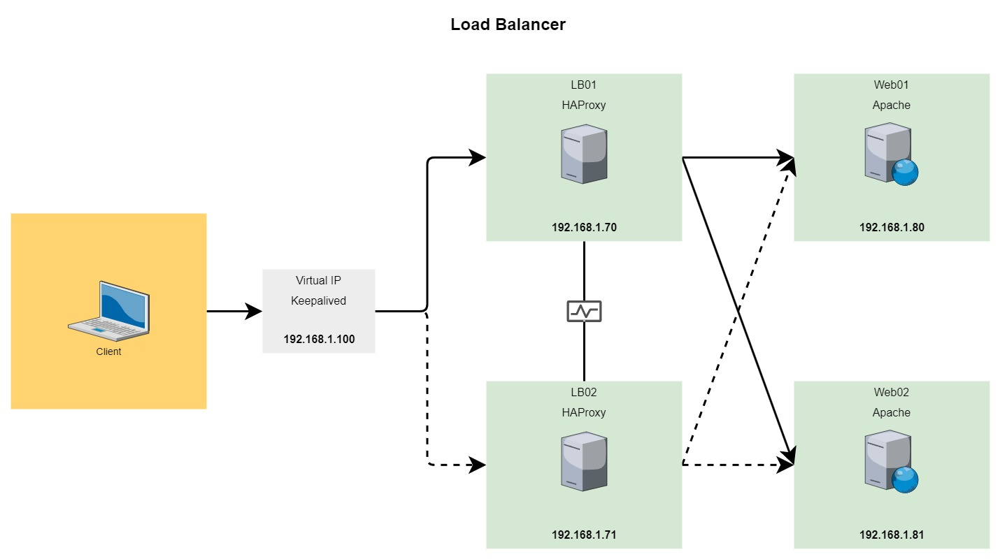
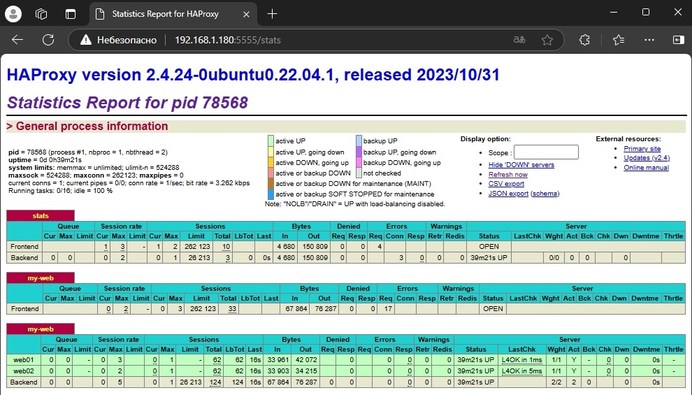

# Load Balancer (Keepalived + HAProxy)


##  Install and config Keepalived
```bash
apt update
apt install keepalived -y
systemctl enable keepalived
```
- vim /etc/sysctl.conf
- net.ipv4.ip_nonlocal_bind=1
- sysctl -p
### Conf:
vim /etc/keepalived/keepalived.conf

##  Install and config HAproxy
```bash
apt update
apt install haproxy -y
systemctl enable haproxy
```

### Conf:
vim /etc/haproxy/haproxy.cfg

##  Install Web Server Apache:
```bash
apt update
apt install apache2 -y
systemctl enable apache2
```
vim /var/www/html/index.html

`<link>` : <http://192.168.1.180>


### HAProxy Stats
`<link>` : <http://192.168.1.180:5555/stats>

